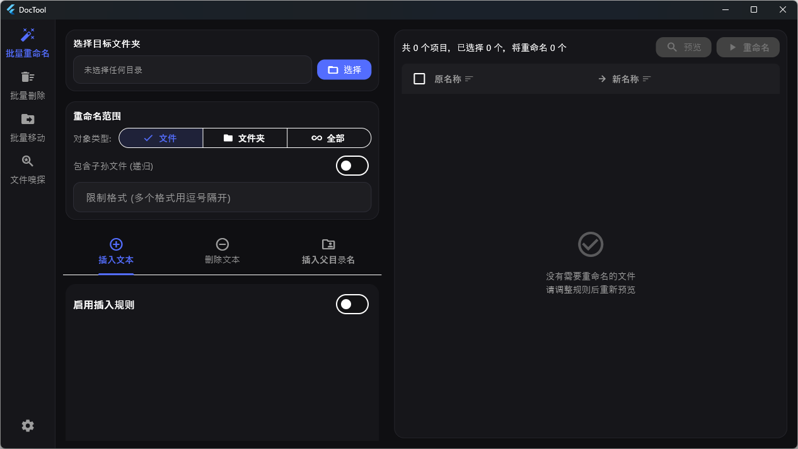
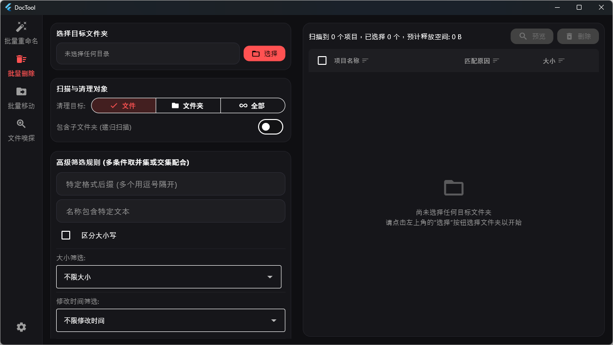
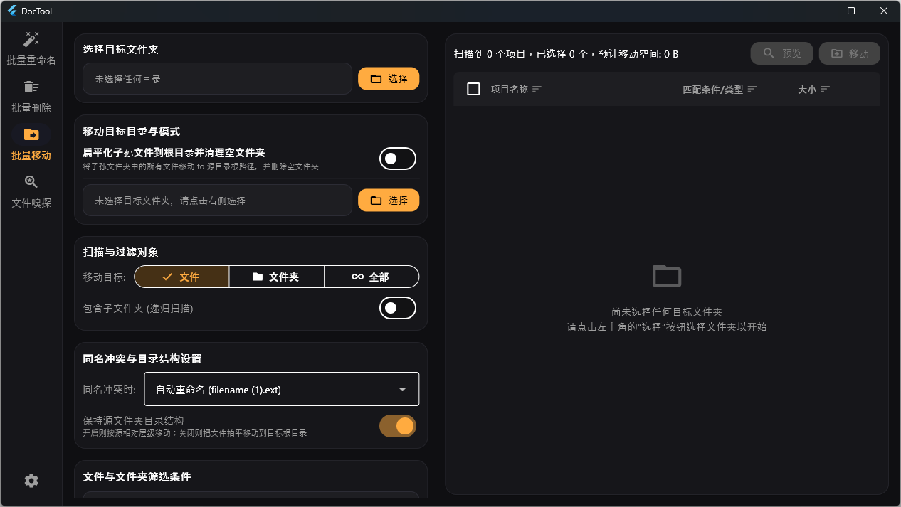
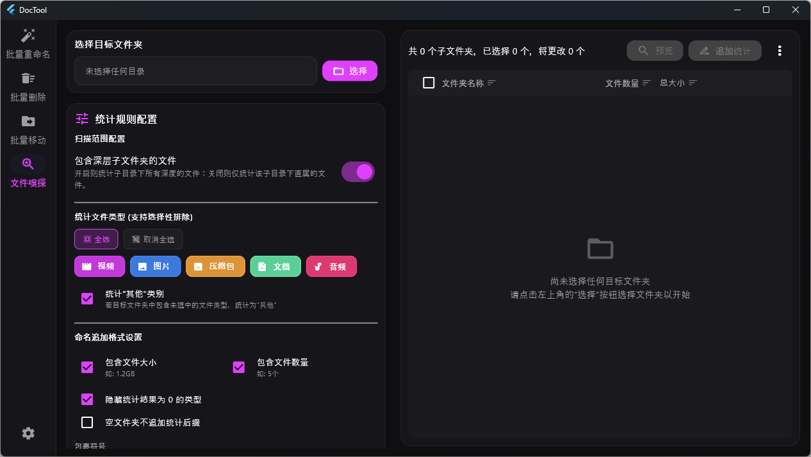

# DocTool

一款基于 Flutter 构建的**跨平台批量文件操作工具**，支持 Windows 和 Android 双平台。提供批量重命名、批量删除、批量移动和文件嗅探四大核心功能，所有操作均支持**实时预览**，确认无误后再执行。

## 功能特性

### 批量重命名

- **插入规则**：在文件名的开头、末尾或自定义位置插入文本，支持自定义分隔符
- **删除规则**：按匹配文本、范围（从头/尾截取）、自定义区间、锚点定位等多种模式删除文件名中的字符
- **父目录规则**：将父文件夹名称插入到文件名中，方便层级标识
- 支持文件 / 文件夹 / 两者同时操作
- 支持递归扫描子目录、按扩展名过滤
- 实时预览重命名结果，支持逐项勾选

### 批量删除

- 按扩展名、文件名关键字、大小、修改时间等多维度过滤
- 支持 MD5 哈希匹配，精准定位特定文件
- 一键筛选空文件、空文件夹、重复文件
- 多线程哈希计算，大目录也能高效扫描
- Windows 平台使用 Win32 API 实现高速删除
- 扫描进度实时显示，删除前可逐项确认

### 批量移动

- 与删除共享多维度过滤规则（扩展名、关键字、大小、时间、哈希等）
- 支持保留目录结构 / 展平到根目录两种移动模式
- 冲突策略：自动重命名 / 覆盖 / 跳过
- 可在移动过程中自动清理指定大小以下的文件
- 实时预览移动路径，支持逐项勾选

### 文件嗅探

- 扫描子文件夹，自动统计其中各类型文件的数量与大小
- 内置视频、图片、音频、文档、压缩包五大分类，覆盖 80+ 种常见扩展名
- 根据统计结果自动生成文件夹重命名建议（如 `假期照片 (128张 3.2GB)`）
- 可自定义启用的文件类型、量词和命名模板
- 支持递归扫描，一键批量重命名文件夹

### 通用特性

- Material Design 3 风格 UI，支持亮色 / 暗色 / 跟随系统三种主题
- 响应式布局：桌面端（≥900px）侧边导航 + 分栏，移动端底部导航 + Tab 切换
- 主题偏好本地持久化

## 应用截图

| 批量重命名 | 批量删除 |
|:---:|:---:|
|  |  |

| 批量移动 | 文件嗅探 |
|:---:|:---:|
|  |  |

## 支持平台

| 平台 | 状态 |
|------|------|
| Windows | ✅ 支持 |
| Android | ✅ 支持 |

## 环境要求

- [Flutter SDK](https://docs.flutter.dev/get-started/install) ≥ 3.4.0
- Dart SDK ≥ 3.4.0 < 4.0.0
- Windows：Visual Studio 2022（含 C++ 桌面开发工作负载）
- Android：Android SDK（minSdk 21）

## 快速开始

```bash
# 克隆仓库
git clone https://github.com/your-username/DocTool.git
cd DocTool

# 安装依赖
flutter pub get

# 运行（Windows）
flutter run -d windows

# 运行（Android）
flutter run -d <device-id>

# 构建 Windows 发布版
flutter build windows --release

# 构建 Android APK
flutter build apk --release
```

## 项目结构

```
lib/
├── main.dart                  # 应用入口、主题配置、主仪表盘与布局
├── utils/
│   ├── rename_logic.dart      # 批量重命名规则与逻辑
│   ├── delete_logic.dart      # 批量删除过滤与执行逻辑
│   ├── move_logic.dart        # 批量移动过滤与执行逻辑
│   ├── sniffer_logic.dart     # 文件嗅探统计与命名逻辑
│   ├── file_helper.dart       # 目录扫描与权限管理
│   ├── file_hash_utils.dart   # 文件哈希计算工具
│   ├── hash_cache_manager.dart# 哈希缓存管理
│   └── theme_helper.dart      # 主题颜色扩展
└── widgets/
    ├── rename_rule_panel.dart  # 重命名规则配置面板
    ├── preview_panel.dart      # 重命名预览面板
    ├── delete_rule_panel.dart  # 删除过滤配置面板
    ├── delete_preview_panel.dart# 删除预览面板
    ├── move_rule_panel.dart    # 移动过滤配置面板
    ├── move_preview_panel.dart # 移动预览面板
    ├── sniffer_rule_panel.dart # 嗅探配置面板
    ├── sniffer_preview_panel.dart# 嗅探结果面板
    └── android_dir_picker.dart # Android 目录选择器
```

## 许可证

本项目基于 [MIT License](LICENSE) 开源。
